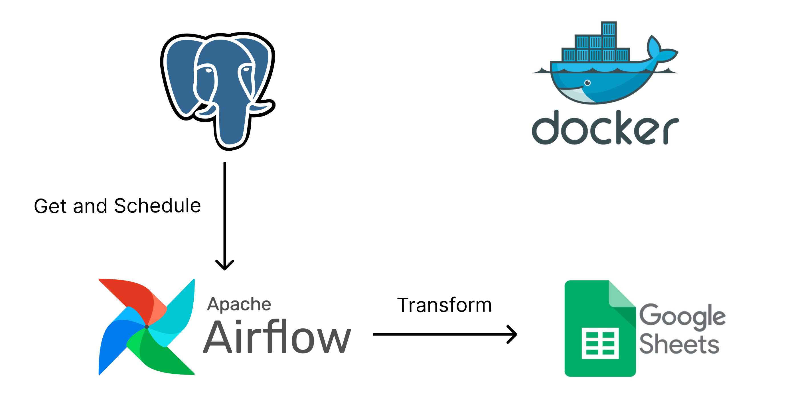

# Schedule Data
Performing data load from PostgreSQL and transforming it into a Google Sheet. In this project, I am applying the ETL method for data transformation, followed by scheduling the execution every day at 2 AM.

## About the Data
The data I'm using is dummy data provided by the bootcamp instructor. The hope is that students can apply the ETL Scheduling method using Airflow. In this case, students are given the freedom to explore how to establish a connection between a PostgreSQL database and Airflow. Then, how to schedule jobs every night at 2 AM. In this aspect, students use XCom to establish connections between Directed Acyclic Graphs (DAGs) involved in the ETL process. This aims to create efficient integration between different parts of each workflow

## Flow Project

## Result Job

## Tools
### Postgre SQL
PostgreSQL is a versatile database that can be used for various purposes. With rich features, high scalability, and a large community, PostgreSQL is the right choice for a range of applications, from simple web applications to complex enterprise systems

### Apache Airflow
Apache Airflow is an open-source workflow orchestration platform that enables you to schedule and manage complex workflows consisting of various tasks. The platform is widely used for data pipelines, machine learning, and automation of various tasks.

### Kredensial Google Sheet:
Google Sheet Credentials are authentication information that allows external applications or tools to access and manage data in Google Sheets. These credentials consist of a Client ID and Client Secret, which can be obtained from the Google Cloud Platform (GCP)

## Getting Started
### Prerequisites
- [Practice Handson](https://docs.google.com/spreadsheets/d/1CDqjVawY8aKLQD6ycQoQ6mUQ4TSbdrO5lh6MuxdaLhQ/edit#gid=0)

### Configuration
1. Create your google sheet Credentials [Get Credentials Google Sheet](https://medium.com/@a.marenkov/how-to-get-credentials-for-google-sheets-456b7e88c430)
2. Create postgres database at [neon](https://neon.tech/).
